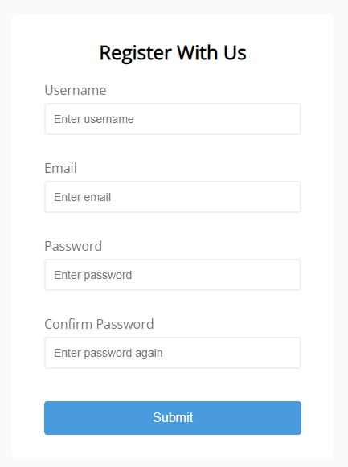

# Form validator

Simple client side form validation.

The purpose of this simple project is to get more fluent with using HTML, CSS and JavaScript.

## Project Specifications

- Create form UI
- Show error messages under specific inputs
- checkRequired() to accept array of inputs
- checkLength() to check min and max length
- checkEmail() to validate email with regex
- checkPasswordsMatch() to match confirm password
